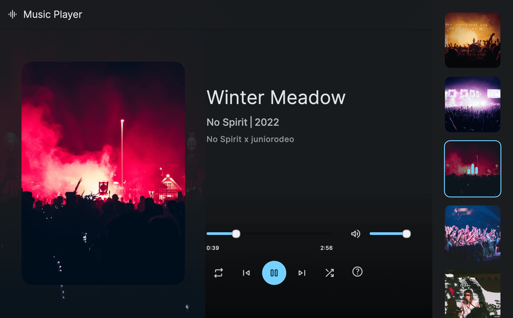

# Simple Music Player

A responsive and mobile-first music player website with essential features such as play/pause, skip, shuffle, repeat, volume control, and keyboard shortcuts.

## Features

- **Simple Design**: Clean and user-friendly interface.
- **Responsive Design**: Optimized for both desktop and mobile devices using mobile-first methodology.
- **Play/Pause**: Use the spacebar to play or pause the music.
- **Skip Tracks**: Skip to the previous or next track.
- **Shuffle**: Play tracks in a random order.
- **Repeat**: Repeat the current track.
- **Volume Control**: Adjust the volume to your preference.
- **Keyboard Shortcuts**: Convenient shortcuts for better user experience.
- **Additional Features**: Various other features enhancing the overall music playing experience.

## Screenshot



## Installation

1. Clone the repository:
    ```bash
    git clone https://github.com/billalben/music-player.git
    ```
2. Navigate to the project directory:
    ```bash
    cd music-player
    ```
3. Open `index.html` in your web browser to use the music player.

## Contributing

Contributions are welcome! If you have any suggestions or improvements, please open an issue or submit a pull request.

## Contact

For any questions or feedback, feel free to contact me at ["billalben252@gmail.com"].

Thank you for checking out my simple music player project!
